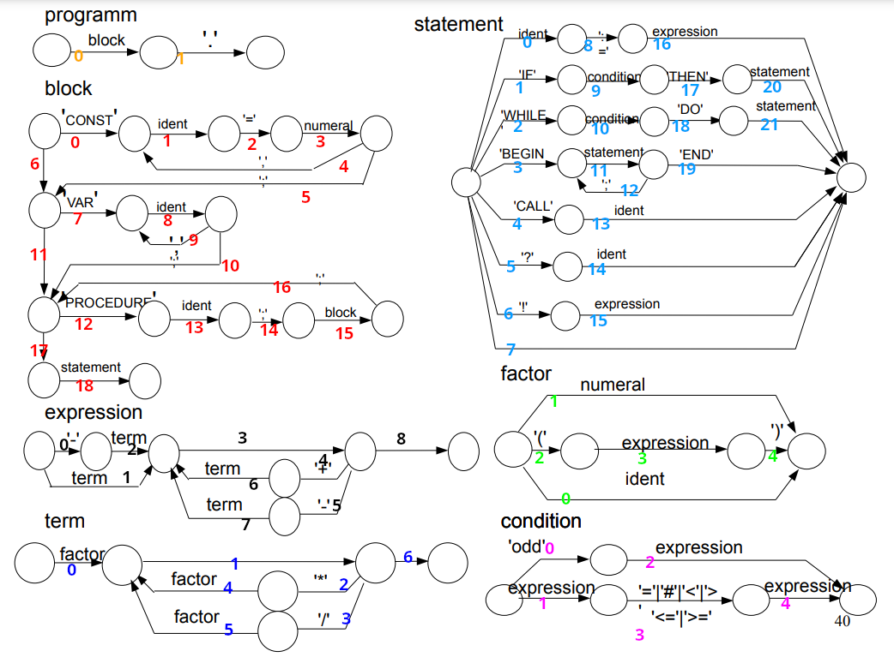

= Dokumentation des PL0-Compilers
Clemens Näther <s85426@htw-dresden.de> 
1.0, 22.10.2023
:toc: 
:toc-title: Inhaltsverzeichnis
:source-highlighter: rouge
// Platzhalter für weitere Dokumenten-Attribute 

== Einführung

Der PL0-Compiler ist ein Compiler für die Programmiersprache PL0. Er wurde im Rahmen der Vorlesung "Compiler/Interpreter" an der HTW Dresden entwickelt.

=== Was ist PL0?

PL0 ist eine Programmiersprache, die in den 1970er Jahren von Niklaus Wirth entwickelt wurde. Sie ist eine vereinfachte Version von ALGOL und wurde als Lehrsprache für die Programmierung von Algorithmen entwickelt. PL0 ist eine imperative Programmiersprache, die sich durch ihre einfache Syntax auszeichnet. Sie ist daher gut geeignet, um die Grundlagen der Programmierung zu erlernen.

=== Was ist ein Compiler?

Ein Compiler ist ein Programm, das Quellcode in eine andere Programmiersprache übersetzt. Dabei wird der Quellcode in einzelne Bestandteile zerlegt, die dann in eine andere Sprache übersetzt werden. Der Compiler ist ein wichtiger Bestandteil der Softwareentwicklung, da er die Entwicklung von Programmen erleichtert.

== Lexer

== Parser

=== Aufbau der Graphen

